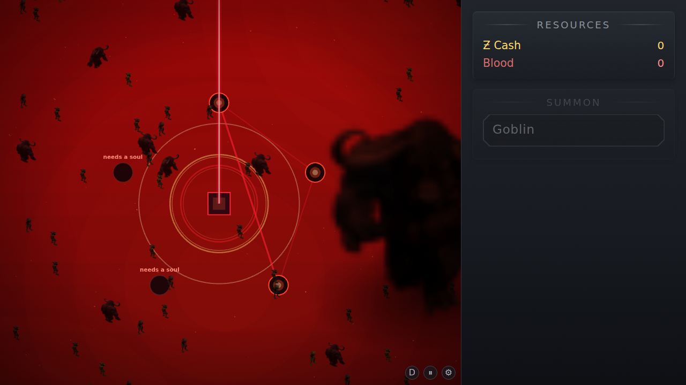
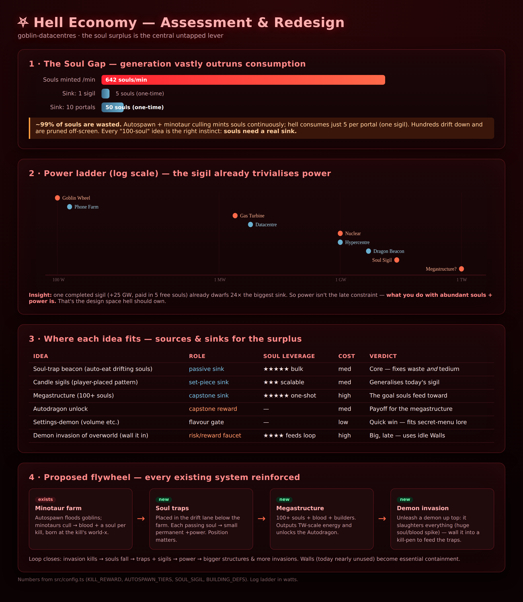

# Hell — Assessment & Redesign Brainstorm

*A design doc, not a spec. Captures where Hell is today, what's out of balance, and
how the brainstormed ideas could fit together into one coherent economy + story arc.*

---

## 1. What Hell is today

Descend (hold ↓) into a second, larger view. Mechanically it currently offers:

| System | What it does | Cost / gate |
|---|---|---|
| **Souls (ghosts)** | One spawns at the world-x/y of *every* kill, drifts down, and is **pruned off the bottom — wasted.** | free, automatic |
| **Soul Sigil** | 5 chairs ringed around each portal's mirror. Walk a soul into each → **+25 GW** while all 5 filled. | 5 souls + 1 portal (Ƶ10M + 1000 blood) |
| **Demon parlay** | One giant patrolling minotaur. Walk a soul up to it. Bob + a dragon bone → unlock **Lightning Strike** (one-time). Other souls only babble. | a soul + (for the gift) a dragon bone |

Everything else in Hell is atmosphere (embers, fog, the void).

### The progression it sits inside
`Ƶ100 → Phone Farm → Gas Turbine → Datacentre → Hypercentre → Dragon Beacon + Hell Portal → collect 5 dragon bones (secret settings)`

Two intertwined currencies drive it:
- **Ƶ (money)** — building income + kills → builds buildings.
- **Blood** — 1/goblin-kill, 128/minotaur-gore → summons (minotaur, dragon 64, lightning 256), rituals (autospawn ≤416, autowater 128), dig (100–2000), the portal (1000).

The **kill engine** is a flywheel: Autospawn drops a free goblin every 3 s (×1…×32 ≈ **10.7 goblins/s** at the top tier), minotaurs cull the horde, each kill returns **1 blood + 25 Ƶ + one soul**.

---

## 2. The core finding: the Soul Gap

> **Souls are minted by the hundreds. Hell consumes 5 per portal. ~99% are wasted.**

This is the single most important fact about Hell's balance, and it's *exactly* the
tension your instincts keep circling ("there are likely hundreds of souls… things
that require 100+ souls"). Souls are a vast, free, unused resource. **Every idea that
gives souls a sink is pushing the right direction.**

Two corollaries worth pinning down now:

1. **Power is already solved.** One completed sigil = **+25 GW**, paid in 5 free souls
   — that's 25× a Nuclear Reactor and ~5× the biggest sink (Dragon Beacon, 5 GW). So
   raw wattage is *not* the interesting late-game constraint. **What you do with
   abundant souls + abundant power is.** Hell should own that space.

2. **Manual soul-walking does not scale.** Today you walk souls one at a time into
   chairs. That's already fiddly for 5; any "100-soul" mechanic built on manual walking
   would be agony. **Bulk soul sinks must be passive/positional, not click-per-soul.**
   (This is the strongest argument for the soul-trap idea below.)

---

## 3. The ideas, sorted

Grading each on **soul leverage** (does it drain the surplus?), **fit** with existing
systems, **cost** to build, and **fun**.

### Keepers — they reinforce each other into one economy

| Idea | Role | Soul leverage | Notes |
|---|---|---|---|
| **Soul-trap beacon** (auto-eats drifting souls) | passive sink | ★★★★★ | Fixes waste *and* tedium. Souls already spawn at the kill's world-x, so placing traps under your minotaur farm is real positional optimisation. |
| **Candle / pentagram sigil** (player-placed) | set-piece sink | ★★★★ | Generalises today's fixed sigil into something you build anywhere. See §4 for the geometry answer. |
| **Power multipliers** (1 W seed → stack ×) | exponential sink | ★★★★★ | Turns souls into *doublings*. The natural "what's in the middle of the pentagram." See §4. |
| **Megastructure** (100+ souls to build) | capstone sink | ★★★★★ | The destination the surplus feeds toward. Output: apocalyptic (TW). |
| **Autodragon** unlock | capstone reward | — | The payoff for finishing a megastructure (or a demon's grand bargain). Gate it hard. |
| **More demons / settings-demon** | flavour + gates | low–med | Cheap charm; demons become the quest-givers that gate the above. See §5. |
| **Demon invasion** (wall it in) | risk/reward faucet | ★★★★ | The late-game faucet that feeds the whole loop, and finally makes **Walls** matter. See §6. |
| **Bob's betrayal arc** | narrative spine | — | Ties the demons together into a story. See §7. |

### Fold-ins (not standalone features)
- *"Massive amount of energy"* → the **payoff theme**, delivered by multipliers + megastructure, not a mechanic itself.
- *"Things requiring 100+ souls"* → the **design principle**, realised by traps/megastructure.
- *"Demons going back and forth"* → fold into invasion/trap pacing (demons pace between soul traps / kill-pens).

---

## 4. Unifying the candle + pentagram + multiplier ideas

Your three sigil-adjacent ideas are really **one mechanic**. Here's a version that
answers "how do I stop the pentagram being too big or small?" and "what happens in the
middle?" at once.

### The Pentagram Multiplier

1. **Place candles, but snap to a fitted star.** Drop the first candle to set the
   *centre*; a second drag sets *size + rotation*; the remaining 4 vertices auto-appear
   as a perfect pentagram. The "needs x candles" prompt still reads naturally (the
   slots glow "needs soul" until fed) but **the player never hand-places 5 loose points**
   — which kills the degenerate-geometry problem entirely.
   - *Alternative if you want free placement:* enforce a **min spacing** (reject candles
     closer than R_min) and a **max reach** (the 5th must close within R_max). Both
     bound the size band without a UI handle.

2. **Size is self-balancing because both cost and ceiling scale with it.**
   A bigger pentagram has *more soul capacity* (higher multiplier ceiling) but *needs
   more souls to charge each tier*. So a tiny star can't cheese huge power, and a huge
   star isn't free — it's a deliberate, soul-hungry commitment. Formally:
   - `soulsPerTier(size) ∝ area` → big stars are slow to climb.
   - `maxTier(size) ∝ area` → only big stars reach the absurd multipliers.

3. **What's in the middle: a power seed the sigil multiplies.** Light the pentagram and
   a tiny **1 W seed** ignites at the centre. Feeding souls into the five candles raises
   a **multiplier** on that seed: ×2 per *N* souls consumed. The fun is watching
   `1 W → kW → MW → GW → TW` as the surplus pours in.
   - Keep it a **parallel track** to the additive grid at first, so it doesn't instantly
     break the 25 GW sigil math — the seed starts negligible and *overtakes* the grid
     only after serious soul investment. Late game, the multiplier becomes the dominant
     power source, which is the right shape for an idle-game climax.

### Why multipliers fit the soul surplus mathematically
Additive sources give **linear** power growth — souls run out of things to buy.
A multiplier ladder where tier *n* costs `N·k^n` souls means reaching `seed·2^n`
consumes a **geometric** pile of souls. That gives hundreds-of-souls an appetite that
*keeps* scaling, instead of saturating after one sigil. It's the cleanest possible
sink for an uncapped resource.

> **Net:** one feature — *place a pentagram, feed souls, watch a seed multiply* —
> absorbs candles, pentagram, "something in the middle," 100+ souls, massive energy,
> **and** power multiplication.

---

## 5. A demon roster (you said you'll add more)

Make demons the **quest-givers** that gate the big rewards. Each is a parlay (existing
system) with a demand and a gift. A simple shared shape: *demand → check → gift, or get
struck back on a lie* (the Bob/dragon-bone flow already does this).

| Demon | Demands | Gift | Soul sink? |
|---|---|---|---|
| **The Listener** (settings-demon) | a game-setting state — "set the music to silence", "blood runs *red*", volume to max | a cosmetic/QoL boon or a hint | no — pure charm, cheap |
| **The Glutton** | feed me *100 souls* (channel them into its maw over time) | permanent grid bonus / a multiplier tier | ★★★★★ |
| **The Smith** (current bone-demon) | a dragon bone | Lightning (today) — could escalate to more bones → bigger rituals | — |
| **The Architect** | complete a megastructure in its name | **Autodragon** | ★★★★★ |
| **The Warden** | release me to the surface and survive my rampage | a flood of blood/souls + a permanent boon | feeds the loop |

The **settings-demon** is the cheapest win and fits the lore perfectly — the *secret
settings menu is already a demon's gift*. A demon who insists you mute the music or
crank the volume is a great fourth-wall gag and is ~an afternoon of work (read
`options`, check, reward).

Design knobs already in the codebase that demons can read/demand: `volume`,
`musicVolume`, `crackleEnabled`, `bloodColor`, `gridVisible`, `hellGhostFallSpeed`, etc.

---

## 6. Demon invasion — the faucet that finally uses Walls

Unleash (or fail to contain) a demon on the **overworld**. It slaughters everything —
goblins, minotaurs, *and* dragons — producing a huge spike of blood + souls. But it
also threatens your economy, so you **wall it into a kill-pen** beneath your minotaur
farm, where the souls it makes drop straight into your traps.

Why it's worth the (high) build cost:
- **Closes the flywheel:** invasion kills → souls fall → traps + pentagram → power →
  bigger structures → bigger invasions.
- **Gives Walls a job.** Walls cost Ƶ1 and currently do almost nothing; containment
  makes them strategic.
- **Real risk/reward.** Today nothing damages your buildings except a dragon hauling
  one away. An invasion that can wreck buildings raises the stakes the late game lacks.

Implementation reality check (this is the most expensive idea):
- Needs demon AI in the *overworld* (pathing, target selection across goblins/minotaurs/dragons).
- Needs a damage model for buildings (new — nothing currently destroys a building in place).
- Needs containment rules (walls block the demon; a sealed pen = safe soul farm).
- Sequence it **after** traps + pentagram exist, so the soul flood has somewhere to go.

---

## 7. Bob's arc — a story spine for the demons

Bob is already special: the only soul who can truly parlay, and the lightning gift runs
through him. A **betrayal arc** gives the demon roster a throughline:

1. **Act I (today):** Bob parlays honestly, earns you Lightning. Trust.
2. **Act II — temptation:** As you work Bob to death over and over (he resurrects), his
   parlay lines curdle. A demon (the **Glutton** or a new **Tempter**) offers Bob a
   deal behind your back.
3. **Act III — the deal:** Bob strikes a bargain. Consequences could be mechanical, e.g.
   - your minotaurs occasionally turn on *you* / refuse a kill,
   - a portion of your soul stream is "tithed" to Bob's demon,
   - or Bob stops resurrecting as your goblin and reappears as a **demon-aligned NPC**.
4. **Act IV — confrontation:** A set-piece — out-feed the Glutton, complete the
   Architect's megastructure first, or release the Warden to break the pact. Resolving
   it could be what unlocks the **Autodragon** / true ending.

This reframes Hell from "a power utility" into "a place with intentions," and gives the
new demons a reason to exist beyond being vending machines.

---

## 8. Recommended build order

Sequenced so each layer has somewhere to feed and de-risks the next:

1. **Soul traps** *(unblocks the surplus + kills the tedium; medium cost).* Passive,
   positional consumption of drifting souls → small permanent power. Immediately makes
   the hundreds of souls *mean* something.
2. **Pentagram multiplier** *(the marquee soul→power sink; medium cost).* Place-a-star,
   feed-souls, multiply-a-seed. Folds in candles, "100+ souls," multipliers, and
   "massive energy" in one feature. Generalises the sigil you already have.
3. **Demon roster + settings-demon** *(cheap charm; low cost).* Stand up the
   demand→gift parlay framework; ship the settings-demon as the first new one.
4. **Megastructure → Autodragon** *(capstone; high cost).* The 100+-soul destination
   and its reward, gated behind the Architect.
5. **Bob's betrayal arc** *(narrative; medium, incremental).* Layer dialogue + a demon
   pact over the roster as it grows.
6. **Demon invasion** *(biggest system; high cost).* Build last — it needs building
   damage + overworld AI, and it's the faucet that the earlier sinks are sized to drink.

### Balance guardrails to hold while building
- Keep the **multiplier seed parallel** to the additive grid early, so it ramps rather
  than instantly trivialising power.
- Tie **soul cost to size/tier** everywhere (`∝ area` for pentagrams, `k^n` for
  multiplier tiers) so no extreme dominates.
- Size invasion **soul output** to roughly match what traps + pentagram can *absorb*, so
  the faucet and the drains stay in conversation.
- The settings-demon and Bob arc are **flavour** — they should gate or reward, never be
  load-bearing for power, so balance can't pivot on a gag.
